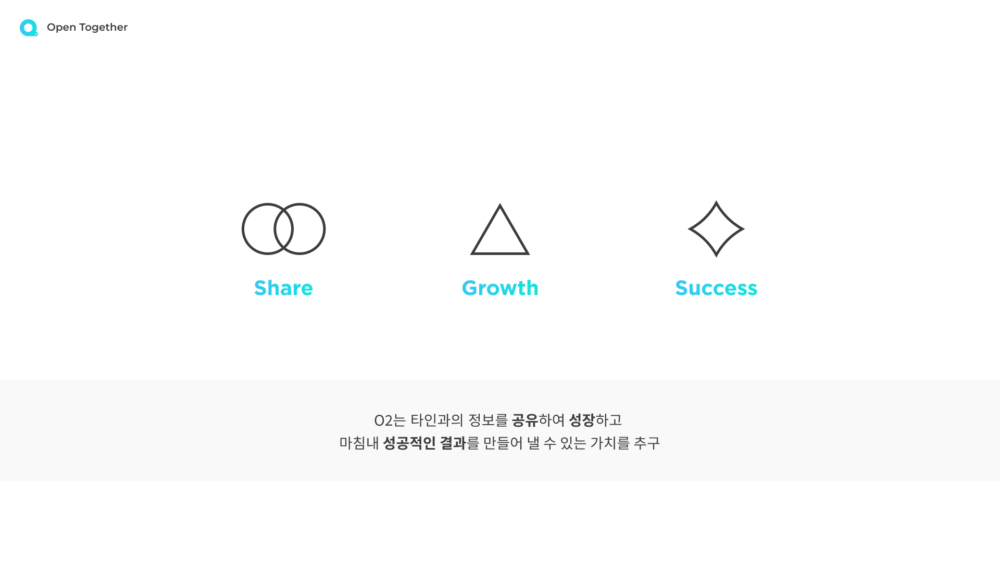

# <p align="center">Open Together, O2 　</p>
    

<p align="center"></p>

 ## ***함께 성장하는 공간, CEO들이 마시는 산소 O2***

 <br></br>

- SOPT 28th WEBJAM   

- 프로젝트 기간: 2021.06.26 ~ 2020.07.17
- [API 명세서](https://www.notion.so/API-docs-7ea0d6ba794942c09e1850200a63bdf6)
- [Notion](https://chatter-gallium-16e.notion.site/Server-e02ec53e702a4f53a15737edfb394f5b)
- [Code Convention](https://github.com/Team-O2/Back-end/blob/develop/README/CodeConvention.md)
- [Git 전략](https://github.com/Team-O2/Back-end/blob/develop/README/Git.md)


<br></b>
# O2
> 예비 창업가가 회고와 강연을 통해 더 성장할 수 있는 기회를 제공하는 커뮤니티 플랫폼. 오투의 메인 기능으로는 회고를 원하는 기간에 맞춰서 쓰는 Learn Myself와 본인이 직접 연사가 되어볼 수 있고 다른 사람들의 성장 및 창업 스토리를 들어볼 수 있는 Share Together가 있습니다.

<br></br>
# Team Core Value 👬👭
<p align="center"></p>

- Share 
  - 자신의 창업 스토리와 오늘의 회고를 다른 사람들과 공유함으로써 "CEO"에 대한 인사이트 넓히기 
- Growth
  - 공유받은 인사이트와 내 스스로 돌아본 내 모습을 통해 더 나은 CEO로 성장하기
- Success
  - 모두와 함께 성공적인 창업가의 길로 나아가기

<br></br>
# Workflow
<p align="center"></p>

<br></br>
# Server Architecture

<p align="center"></p>

```
📦Back-end
┣ 📂src
┃ ┣ 📂config
┃ ┃ ┗ 📜index.ts
┃ ┣ 📂library
┃ ┃ ┣ 📜array.ts
┃ ┃ ┣ 📜returnCode.ts
┃ ┃ ┣ 📜response.ts
┃ ┃ ┣ 📜emailSender.ts
┃ ┃ ┣ 📜date.ts
┃ ┃ ┣ 📜jwt.ts
┃ ┃ ┗ 📜emailTemplete.ejs
┃ ┣ 📂Loader
┃ ┃ ┗ 📜db.ts
┃ ┣ 📂interfaces
┃ ┃ ┣ 📜IComment.ts
┃ ┃ ┣ 📜ILikes.ts
┃ ┃ ┣ 📜IScraps.ts
┃ ┃ ┣ 📜IAdmin.ts
┃ ┃ ┣ 📜IUser.ts
┃ ┃ ┣ 📜IBadge.ts
┃ ┃ ┣ 📜IChallenge.ts
┃ ┃ ┗ 📜IConcert.ts
┃ ┣ 📂middleware
┃ ┃ ┗ 📜auth.ts
┃ ┣ 📂models
┃ ┃ ┣ 📜Admin.ts
┃ ┃ ┣ 📜Concert.ts
┃ ┃ ┣ 📜Badge.ts
┃ ┃ ┣ 📜Challenge.ts
┃ ┃ ┣ 📜User.ts
┃ ┃ ┗ 📜Comment.ts
┃ ┣ 📂service
┃ ┃ ┣ 📜schedulerService.ts
┃ ┃ ┣ 📜adminService.ts
┃ ┃ ┣ 📜authService.ts
┃ ┃ ┣ 📜challengeService.ts
┃ ┃ ┣ 📜concertService.ts
┃ ┃ ┣ 📜noticeService.ts
┃ ┃ ┗ 📜userService.ts
┃ ┣ 📂controller
┃ ┃ ┣ 📜admin.ts
┃ ┃ ┣ 📜auth.ts
┃ ┃ ┣ 📜challenge.ts
┃ ┃ ┣ 📜concert.ts
┃ ┃ ┣ 📜notice.ts
┃ ┃ ┗ 📜user.ts
┃ ┣ 📂modules
┃ ┃ ┗ 📜upload.ts
┃ ┣ 📂DTO
┃ ┃ ┣ 📜authDTO.ts
┃ ┃ ┣ 📜challengeDTO.ts
┃ ┃ ┣ 📜commentDTO.ts
┃ ┃ ┣ 📜concertDTO.ts
┃ ┃ ┣ 📜noticeDTO.ts
┃ ┃ ┣ 📜userDTO.ts
┃ ┃ ┗ 📜adminDTO.ts
┃ ┗ 📜index.ts
┣ 📜eslintrc.json
┣ 📜prettierrc.json
┣ 📜tsconfig.json
┣ 📜tsconfig.paths.json
┣ 📜README.md
┣ 📜.gitignore
┣ 📜nodemon.json
┗ 📜package.json
```
<br></br>
# dependencies module
```json
  "devDependencies": {
    "@types/bcryptjs": "^2.4.2",
    "@types/cors": "^2.8.12",
    "@types/ejs": "^3.0.7",
    "@types/express": "^4.17.12",
    "@types/mongoose": "^5.11.97",
    "@types/node": "^15.12.5",
    "@types/node-schedule": "^1.3.2",
    "@types/nodemailer": "^6.4.2",
    "@typescript-eslint/eslint-plugin": "^4.28.1",
    "@typescript-eslint/parser": "^4.28.1",
    "eslint": "^7.29.0",
    "eslint-config-prettier": "^8.3.0",
    "eslint-plugin-import": "^2.23.4",
    "eslint-plugin-prettier": "^3.4.0",
    "nodemon": "^2.0.7",
    "prettier": "^2.3.2",
    "prettier-eslint": "^12.0.0",
    "ts-node": "^10.0.0",
    "tsconfig-paths": "^3.9.0",
    "typescript": "^4.3.5"
  },
  "dependencies": {
    "@types/lodash": "^4.14.171",
    "aws-sdk": "^2.939.0",
    "bcryptjs": "^2.4.3",
    "cors": "^2.8.5",
    "dotenv": "^10.0.0",
    "ejs": "^3.1.6",
    "express": "^4.17.1",
    "express-validator": "^6.12.0",
    "jsonwebtoken": "^8.5.1",
    "lodash": "^4.17.21",
    "moment": "^2.29.1",
    "mongoose": "^5.13.0",
    "mongoose-validator": "^2.1.0",
    "multer": "^1.4.2",
    "multer-s3": "^2.9.0",
    "node-schedule": "^2.0.0",
    "nodemailer": "^6.6.2",
    "request": "^2.88.2"
  },
```
- aws-sdk : 비차단 I/O 지원, 향상된 시작 성능 및 페이지 매김 응답을 통한 자동 반복과 같이 자주 요청된 다수의 기능  

- bcryptjs : 패스워드 암호화 및 인증
- cors : Cross-Origin Resource Sharing
- dotenv : 환경변수 설정
- express : 웹,서버 개발 프레임워크
- express-validator : 유효성 검사
- jsonwebtoken : JWT(Json Web Token) 생성 및 인증
- lodash : 오브젝트 컨트롤
- multer : 파일 업로드 도구
- multer-s3 : AWS S3 파일 업로드 도구
- nodemon : node.js 서버 개발시에 소스코드에 수정이 있을 경우, 자동으로 서버를 다시 시작해주는 툴
- nodemailer : e-mail을 쉽게 보낼 수 있게 도와주는 모듈
- moment : 날짜와 시간을 다루는 모듈
- mongoose : MongoDB 라이브러리
- mongoose-validator : MongoDB 컨트롤


<br></br>
# 사용된 도구
- Node.js  

- Express.js
- Visual Studio Code - Node.js  editor
- NPM - 자바 스크립트 패키지 관리자
- YARN - 자바 스크립트 패키지 관리자
- MongoDB 
- MongoDBCompass


<br></br>
# 배포  

- AWS EC2 - 클라우드 컴퓨팅 시스템  
- AWS S3 - 클라우드 데이터 저장소

- AWS Load Balancer - 트래픽 분산 시스템

<br></br>

# Team
| **🙋 [고성용](https://github.com/holmir97)** | **🙋 [이현진](https://github.com/hyundang)** |
| :---: | :---: |
| []()    | []() |
| 서버 개발자 | 서버 개발자 |
|프로젝트 세팅<br /> Auth API <br /> User API <br /> Concert API <br /> Admin API <br /> Notice API <br />|프로젝트 세팅 <br /> Auth API <br /> User API <br /> Challenge API <br /> Scheduler <br /> 서버 배포</br>| 
